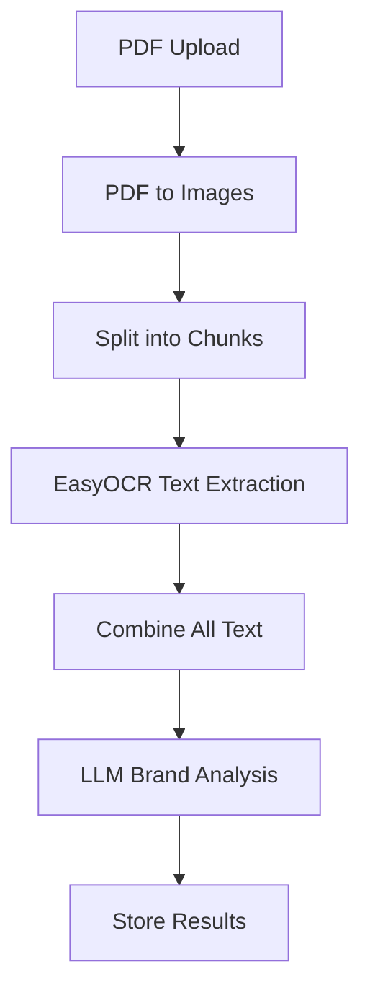

# OCR + LLM Integration for Brand Detection

## Overview

The Document Brand Detection System now uses an **OCR + LLM pipeline** instead of direct image analysis. This approach provides better accuracy and performance by:

1. **Text Extraction**: Using EasyOCR to extract all text from image chunks with coordinate preservation
2. **Text Analysis**: Using Google Gemini LLM to analyze the complete extracted text for brand detection

## Architecture

### Pipeline Flow



### Key Components

1. **OCRService** (`app/services/ocr_service.py`)
   - Handles text extraction using EasyOCR
   - Supports Spanish and English languages
   - Preserves text coordinates
   - Includes retry logic for failures

2. **BrandDetectionService** (`app/services/brand_detection_service.py`)
   - Orchestrates the OCR + LLM pipeline
   - Analyzes extracted text for brands
   - Maintains parallel processing capabilities

## Features

### OCR Capabilities
- **Multi-language Support**: Spanish and English text recognition
- **Coordinate Preservation**: Maintains text position information
- **GPU/CPU Support**: Works on both GPU and CPU environments
- **Retry Logic**: Automatic retry for OCR failures with exponential backoff
- **Accuracy Optimization**: Configured for maximum text detection precision
- **Chunk Processing**: Processes large images in manageable chunks

### LLM Analysis
- **Text-based Analysis**: Analyzes extracted text instead of images
- **Comprehensive Brand Detection**: Detects brands across all text content
- **Context Awareness**: Understands brand mentions in specifications and notes
- **Multi-language Brands**: Recognizes brands in both Spanish and English

## Configuration

### Environment Variables

```bash
# OCR Configuration
USE_GPU=true                    # Use GPU if available, fallback to CPU
OCR_LANGUAGES=["es","en"]       # Spanish and English
OCR_CONFIDENCE_THRESHOLD=0.3    # Minimum confidence for text detection
OCR_MAX_RETRIES=3               # Retry attempts for OCR
OCR_RETRY_DELAY=1.0             # Initial retry delay in seconds

# Image Processing
PDF_DPI=600                     # High resolution for better text detection
MAX_IMAGE_SIZE=20000            # Increased for better resolution
IMAGE_QUALITY=95                # PNG quality for better text clarity
```

### Dependencies

```toml
# pyproject.toml
dependencies = [
    "easyocr>=1.7.0",
    "torch>=2.0.0",
    "torchvision>=0.15.0",
    # ... other dependencies
]
```

## Usage

### Basic Usage

```python
from app.services.brand_detection_service import BrandDetectionService
from PIL import Image

# Initialize service
brand_service = BrandDetectionService()

# Process image
image = Image.open("document_page.png")
result = await brand_service.detect_brands_in_image(image, page_number=1)

# Access results
brands = result.brands_detected
print(f"Detected brands: {brands}")
```

### OCR Service Direct Usage

```python
from app.services.ocr_service import OCRService
from PIL import Image

# Initialize OCR service
ocr_service = OCRService()

# Extract text from image
image = Image.open("document_page.png")
ocr_result = await ocr_service.extract_text_from_image(image, page_number=1)

# Access results
full_text = ocr_result['full_text']
text_detections = ocr_result['text_detections']
processing_time = ocr_result['processing_time']

print(f"Extracted text: {full_text}")
print(f"Processing time: {processing_time:.2f} seconds")
```

## Performance Optimization

### OCR Settings for Accuracy

```python
# Optimized for accuracy over speed
reader = easyocr.Reader(
    ['es', 'en'],  # Spanish and English
    gpu=settings.use_gpu,
    paragraph=True,  # Group text into paragraphs
    height_ths=0.5,  # Height threshold for text detection
    width_ths=0.5,   # Width threshold for text detection
    contrast_ths=0.1,  # Lower contrast threshold for better detection
    adjust_contrast=0.5,  # Adjust contrast for better recognition
    text_threshold=0.6,  # Text confidence threshold
    link_threshold=0.4,  # Link confidence threshold
    low_text=0.3,  # Low text threshold
    canvas_size=2560,  # Canvas size for processing
    mag_ratio=1.5,  # Magnification ratio for better detection
)
```

### Chunk Processing

- **Chunk Size**: 1024x1024 pixels per chunk
- **Overlap**: 200 pixels between chunks
- **Concurrent Processing**: Up to 8 concurrent OCR tasks
- **Memory Management**: Processes chunks to avoid memory issues

## Error Handling

### Retry Logic

```python
# OCR retry configuration
max_retries = 3
retry_delay = 1.0  # seconds

for attempt in range(max_retries):
    try:
        # OCR processing
        results = self.reader.readtext(chunk_array, ...)
        return results
    except Exception as e:
        if attempt < max_retries - 1:
            await asyncio.sleep(retry_delay)
            retry_delay *= 2  # Exponential backoff
        else:
            logger.error(f"All OCR attempts failed")
            return []
```

### Graceful Degradation

- Returns empty results instead of throwing exceptions
- Logs detailed error information for debugging
- Continues processing other pages if one fails

## Testing

### Test Script

Run the integration test:

```bash
cd backend
python test_ocr_integration.py
```

### Test Coverage

The test script verifies:
1. OCR service initialization
2. Text extraction from test images
3. Brand detection from extracted text
4. Complete pipeline functionality

## Monitoring and Logging

### Key Metrics

- OCR processing time per page
- Text extraction accuracy
- LLM analysis performance
- Overall pipeline efficiency

### Logging

```python
# OCR processing logs
logger.info(f"OCR completed for page {page_number}: {len(extracted_text)} characters extracted in {processing_time:.2f} seconds")

# Brand detection logs
logger.info(f"OCR + LLM brand detection completed for page {page_number}: {len(detected_brands)} brands found in {total_processing_time:.2f} seconds")
```

## Troubleshooting

### Common Issues

1. **OCR Not Detecting Text**
   - Check image quality and resolution
   - Verify language settings
   - Adjust confidence thresholds

2. **Slow Processing**
   - Enable GPU acceleration if available
   - Reduce chunk size for memory-constrained environments
   - Adjust concurrent processing limits

3. **Memory Issues**
   - Reduce max image size
   - Process smaller chunks
   - Monitor GPU memory usage

### Debug Mode

Enable debug logging:

```bash
export DEBUG=true
```

## Future Enhancements

### Planned Features

1. **Additional Languages**: Support for more languages
2. **Text Post-processing**: Spell checking and noise removal
3. **Advanced Coordinate Analysis**: Use text position for better context
4. **Batch Processing**: Optimize for multiple documents
5. **Caching**: Cache OCR results for repeated processing

### Performance Improvements

1. **Model Optimization**: Use quantized models for faster inference
2. **Parallel Processing**: Increase concurrent OCR tasks
3. **Memory Optimization**: Better memory management for large documents
4. **GPU Optimization**: Optimize GPU memory usage

## Migration from Previous Version

### Changes Required

1. **Dependencies**: Add EasyOCR and PyTorch dependencies
2. **Configuration**: Update environment variables
3. **Docker**: Update Dockerfile with OCR dependencies
4. **Testing**: Update tests to use new pipeline

### Backward Compatibility

- API endpoints remain the same
- Response format unchanged
- Frontend integration unaffected

## Support

For issues or questions about the OCR integration:

1. Check the logs for detailed error information
2. Run the test script to verify functionality
3. Review configuration settings
4. Monitor system resources (GPU memory, CPU usage)
